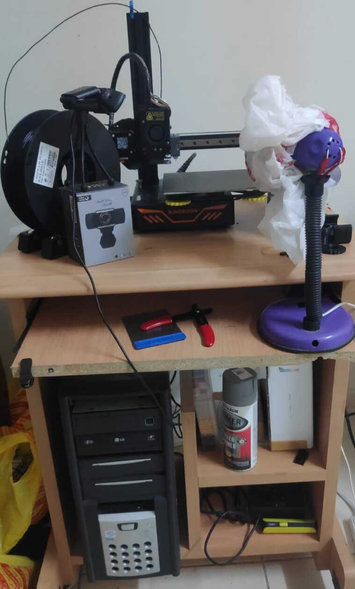
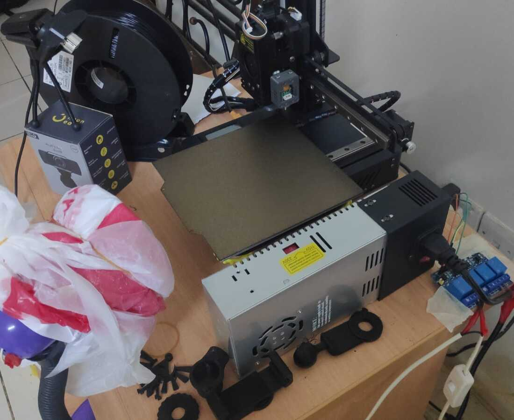
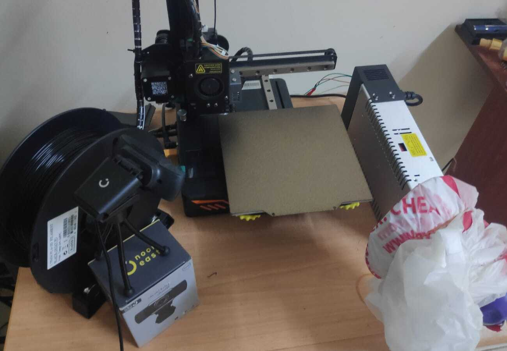
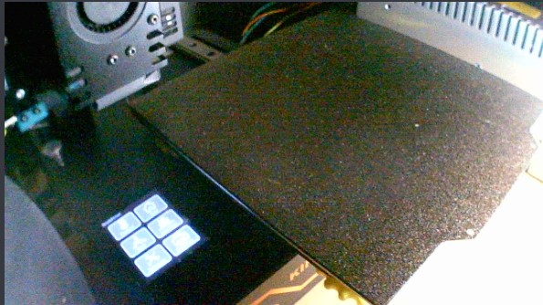
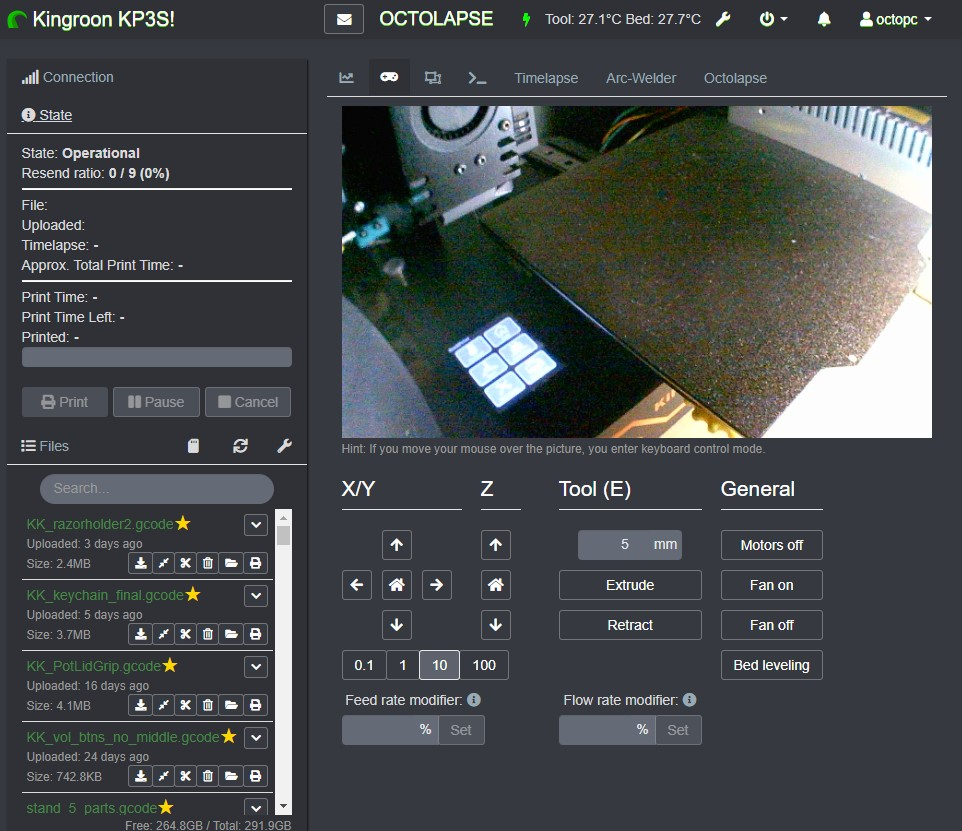
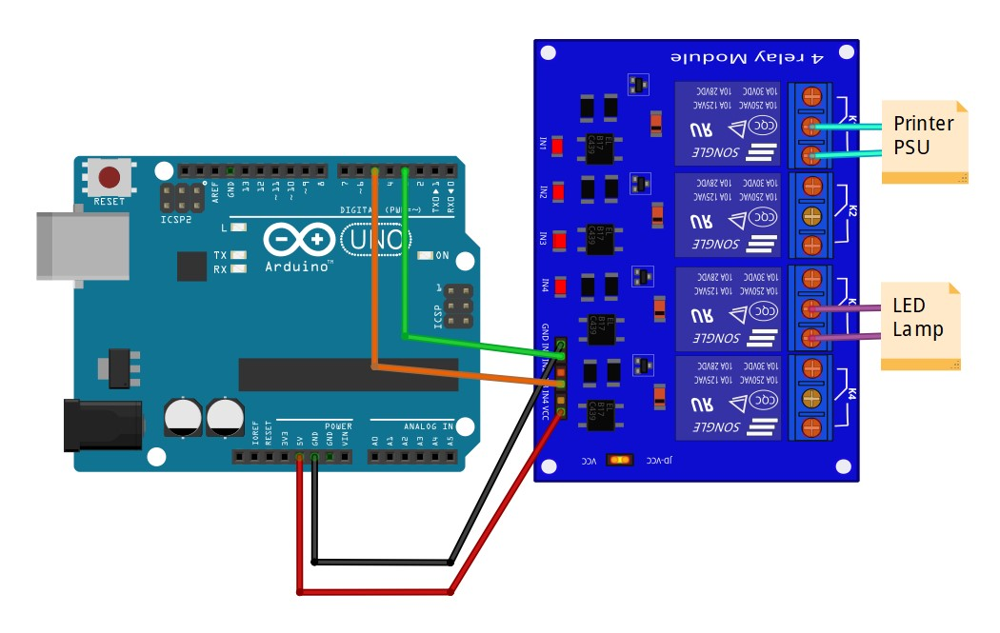
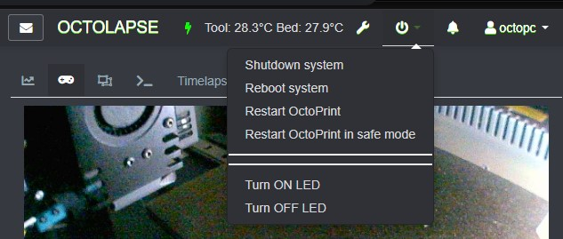

# Kingroon KP3S + Octoprint Setup With Controlled LED Lighting

The following markdown and repository document my personal journey and setup of how I got my Kingroon KP3S FDM printer running with a Linux computer running Linux, Octoprint, MJPG-Streamer, and other codes to control, monitor, and record prints from anywhere in the world!

# Table of contents

- [Kingroon KP3S + Octoprint Setup With Controlled LED Lighting](#kingroon-kp3s--octoprint-setup-with-controlled-led-lighting)
- [Table of contents](#table-of-contents)
  - [Current setup showcase](#current-setup-showcase)
  - [Setting up Octoprint](#setting-up-octoprint)
    - [Octopi](#octopi)
    - [My Approach - A PC from old scrap parts](#my-approach---a-pc-from-old-scrap-parts)
    - [Technical issues with Kingroon's firmware](#technical-issues-with-kingroons-firmware)
    - [Recommended Plugins](#recommended-plugins)
  - [Controlling System's Power](#controlling-systems-power)
    - [Schematic Diagram](#schematic-diagram)
    - [Controlling power to printer](#controlling-power-to-printer)
    - [LED Lamp Control](#led-lamp-control)
  - [Time-lapse Samples](#time-lapse-samples)
    - [Chess Pawn Piece](#chess-pawn-piece)
    - [Razor Blade Holder](#razor-blade-holder)
    - [Hyrule Crest Keychain](#hyrule-crest-keychain)
    - [Pot Lid Cover Handle](#pot-lid-cover-handle)
  - [Conclusion](#conclusion)


## Current setup showcase
The following are some pictures that show the state of the setup as it is now. As you can see, a KP3S printer is placed on the table with a camera and DIY LED lamp pointing at the heated bed at strategic angles. The printer is connected to an old desktop running Ubuntu 20.04 and Octoprint through a USB connection, with the computer being connected to my local network over ethernet.






The view from the attached webcam is as follows:



You can notice from the sample that the LED light is toggled on from within the Octoprint WebUI through the use of a shell script that triggers the arduino connected through USB.

## Setting up Octoprint
### Octopi
The most popular method for creating Octoprint installations is through using ```Octopi```, a specific Linux image from use in various Raspberry pi images.
The only issue that I have personally come with this approach is that, well, Raspberry Pis are really expensive where I live! And I wanted to keep the costs of this setup as low as possible. 
### My Approach - A PC from old scrap parts
Lucky for me, I had enough old spare parts and computer components over the years from dumpster diving and hand-me-downs from other people that I could splice together a barley functional PC!
The specs of the PC were good enough to run Ubuntu, which isn't the lightest installation but I had a Live USB hanging around so might as well use it!
The setup process for the PC itself I wont cover here, its a pretty simple process of following prompts on the installation wizard. Just make sure that you have installed ```openssh-client``` through apt or through the live boatable incase you are running a headless installation as I did here.

Once you have your system up and running, head over to the following link from the official octoprint [forms](https://community.octoprint.org/t/setting-up-octoprint-on-a-raspberry-pi-running-raspberry-pi-os-debian/2337) where they discuss setting up octoprint on raspian (Now Raspberry Pi OS). A Raspberry Pi is nothing more than a Linux computer, so following the same steps as the guide will get you a Linux Environment with an MJPG video streaming server and a nice URL up and running and ready for you to start prints and monitor them in the network!

### Technical issues with Kingroon's firmware
Now After my first attempt of installing Octprint, everything started working well and I was beyond happy! until disaster struck....
During one long test print, I heard some horrible noise coming from my printer, but I ignored said noise since the print was going well. When the print finished, and the nozzle was heading towards the home position, the printer ***completely*** ignored the contact switches and kept ramming at the end with not stop. I had to manually plug the power cord out to cut power to the printer and stop this behavior.

After intense troubleshooting and a deep dive in my installation, the problems, turns out, is from the firmware of the printer it self! Apperantly, the stock printer firmware has issue understanding some merlin commands that Octoprint sends out which causes crashes in the printer and some un-received code to pile up and crash its memory. I tried updating to a newer firmware (since there was one with a 3D-Touch support) but that had issues with actually running said 3D-Touch sensor, so I just defaulted to a recent enough firmware version I aquired from a drive link available through the official kingroon website (I attached said firmware file in this repo for safekeeping purposes though). For now, 3D-Touch based probing simply does not work! but the printer is tuned well enough for me to not even worry about leveling that much. Plus, I personally use a PEI bed so bed adhesion is not that big of an issue.

To summarize, make sure you at least update your printer's firmware to the version I have added here in the repo ```Robin_nano.bin``` by putting the file in an SD card and rebooting the printer with the SD card inserted.

From there on, you should be ready to further customize your Octoprint installation with plugins and other features. The next section shares some plugins I personally use and recommend so do give it a look!

### Recommended Plugins
The following are a list of plugins that I am currently using:
* [Themeify](https://github.com/birkbjo/OctoPrint-Themeify): Using it for Dark mode theme. really cool look if i say so!
* [Tempsgraph Plugin](https://github.com/1r0b1n0/OctoPrint-Tempsgraph): Better intractable temperature graph on the home screen of octoprint.
* [PSU Control](https://github.com/kantlivelong/OctoPrint-PSUControl): Coupled with my arduino circuit, allows for controlling the printer's power supply and the LED lamp.
* [OctoText](https://github.com/berrystephenw/OctoText): E-mails sent to me for different notifications regarding the printer.
* [Navbar Temperature Plugin](https://github.com/imrahil/OctoPrint-NavbarTemp): Useful for having a quick glance of what the current temperature of the nozzle and heated bed are without going to the control tab.
* [Exclude Region](https://github.com/bradcfisher/OctoPrint-ExcludeRegionPlugin): Luckily, I have not had the chance to use it, better safe than sorry. This plugin allows you to exclude a region of your bed when printing incase a failure occurred there, thus allowing you to carry on with the rest of the region!
* [Octolapse](https://github.com/FormerLurker/Octolapse): I really like this one! Allows for a wide range of time-lapse settings and GCode edits to make the nozzle travel to specific locations for better snapshots and smoother time-lapse videos. Some results will be shown later on.
* [OctoEverywhere!](http://www.OctoEverywhere.com): Really cool service. Allows for secure remote access of your printer anywhere in the world. Really useful if i say so!

With the current setup, here is a snapshot of how my personalized octoprint instance looks like:



## Controlling System's Power
For better power consumption rates, the need for powering the printer on and off was of utmost necessity. To facilitate this, the use of a micro-controller with a relay circuit was employed.
### Schematic Diagram 
An Arduino Uno and a 4 channel-relay module were used for their low cost and simple use. 4 wires (2 for power and 2 for digital control of two relays) were soldered directly into the relay module and then connected into the female headers of the Arduino. The sketch (also attached within this repo) uses serial USB communication to send commands to the arduino. Pins 3 and 5 are used to control the power into the printer and the LED lamp respectively. All that was left was to splice the wire of the printer and the LED lamp to have them connected into the normally open relay side as shown in the following connection diagram:




### Controlling power to printer
The shell script used to trigger the printer is pretty simple and consists of establishing serial communication with the arduino at a baud rate of 9600 baud and asking for the arduino to trigger the desired relay (relay 1 in case of turning on the printer's supply, relay 3 for LED)

```bash
stty 9600 -F /dev/ttyACM0 raw -echo && cat /dev/ttyACM0 & echo "relay1">/dev/ttyACM0
```

Within octoprint's PSU control plugin, I have setup the following shutdown command that turns off both the printer and the LED light. This is also set to be triggered in case the system idled for 30 minutes.
```bash
stty 9600 -F /dev/ttyACM0 raw -echo && cat /dev/ttyACM0 & echo "off_all">/dev/ttyACM0
```
### LED Lamp Control
For controlling the LEDs, it is the same logic. The script was saved in the home directory and made executable with ```chmod +x```. Two files (```led_on.sh``` and ```led_off.sh```) were made, one for turning ON the lamp and the other to turn it OFF. This of course could have been done in a single file but this worked out file and was simple enough to add without any extra plugin. Then through ```.octoprint/config.yaml```, a command was added under system actions as follows:
```code
system:
    actions:
    - action: divider
    - action: ledon
      async: true
      command: ~/led_on.sh
      name: Turn ON LED
    - action: ledoff
      async: true
      command: ~/led_off.sh
      name: Turn OFF LED
```
This makes it so that from the top bar's quick access settings menu, a divider and the two LED options are easily available. Please note that the commands are set as __async__ to avoid octoprint crashes since the shell scripts establish a serial communication and as such timing is important, so making the commands run in an asynchronous fashion fixes this issue. Here is a sample of how the new settings menu would look like:





## Time-lapse Samples
Now the fun part, some time-lapse samples of prints done using this system!
### [Chess Pawn Piece](https://www.thingiverse.com/thing:470700)


### [Razor Blade Holder](https://www.thingiverse.com/thing:5480390)


### [Hyrule Crest Keychain](https://www.thingiverse.com/thing:1230580)


### Pot Lid Cover Handle


## Conclusion
Overall, this was a really interesting and fun projects that allowed me to further deepened my knowledge in 3D Printing, scripting, Linux-based development, and troubleshooting and problem solving. I count this as an overall success! I rarely have to worry about monitoring or forgetting my printer on, it is such a librating feeling once you see your creations come to life and develope right in front of your eyes!

As for future developments, proper encapsulation of the relay module and better protection from the environment would be nice since it is literally being taped to the table it is at right now.
Another improvement would be a better camera to record better time-lapses or a system with multiple cameras to account for different angles and scenarios.

And as a final side note, thank you for reading this through to the the end! I hope you at the very least found this interesting. Thank you for your time and until next time, take care!
